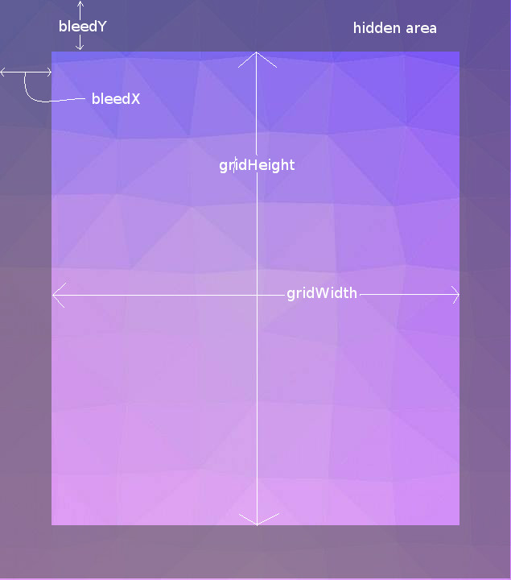
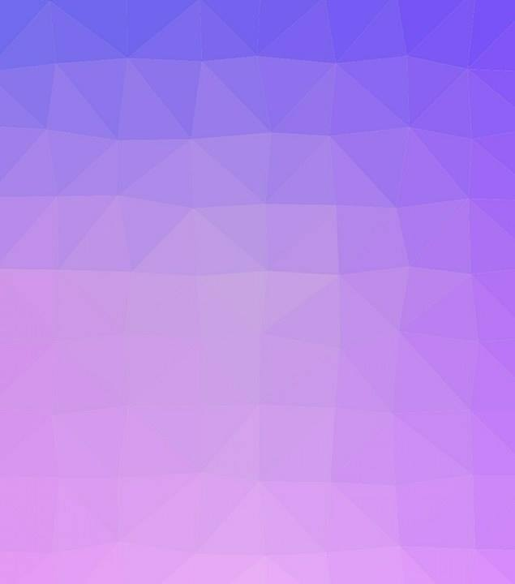

# Trianglify
Trianglify is an Android library that helps creates views with beautiful patterns. Trianglify is based on MVP architecture and licensed under MIT license

## Documentation
### Using TrianglifyView

#### Attributes

| Java method | XML Attributes       | Description |
|-------------|-----------------|-------------|
|.setGridHeight(...) | grid_height     | Height of the grid to generate |
|.setGridWidth(...)| grid_width      | Width of the grid to generate |
|.setBleedX(...) | bleed_x         | TrianglifyView generates total area having width = gridWidth + 2*bleedX to avoid unfilled triangles at the edges of the view|
|.setBleedY(...) | bleed_y         | TrianglifyView generates total area having height = gridWidth + 2*bleedY to avoid unfilled triangles at the edges of the view |
|setVariance(...) | variance        | Displacement of points from original grid position to create triangles of different sizes            |
|.setCellSize(...)| cell_size       | Size of cells of rectangular grid used to generated vertices of the triangles |
|.setGridType(...) | grid_type       | Type of grid 0 for Rectangular           |
|.setFillTriangle(...)| fill_triangles  | Fills the triangle generated with color chosen           |
|.setDrawStrokes(...)| draw_strokes    | Draws triangle's border with neighboring triangle's color           |
|.setPalette(...)| palette         | Set of existing colors to color triangles|
|.setRandomColoring(...)| random_coloring | If random coloring is on triangles will be colored randomly instead of linear interpolation|

##### Explanation of bleed, gridHeight and visible area
Following image demonstrates region covered by gridHeight, gridWidth, bleedX and bleedY  

  

### Example Usages

#### Java
    trianglifyView = (TrianglifyView) findViewById(R.id.trianglify_main_view);  
    trianglifyView.setGridWidth(trianglifyView.getWidth())
                .setGridHeight(trianglifyView.getHeight())
                .setBleedX(50)
                .setBleedY(50)
                .setCellSize(20)
                .setVariance(10)
                .setTypeGrid(0)
                .setPalette(26)
                .setDrawStrokeEnabled(false);
#### XML
    <com.sdsmdg.kd.trianglify.views.TrianglifyView
        android:id="@+id/trianglify_main_view"
        android:layout_marginTop="20dp"
        android:layout_centerHorizontal="true"
        android:layout_below="@+id/draw_fill_checkbox"
        android:layout_width="match_parent"
        android:layout_height="match_parent"
        app:cellSize="20dp"
        app:variance="10dp"
        app:bleedX="50dp"
        app:bleedY="50dp"
        app:gridType="rectangle"
        app:palette="Spectral"
        app:fillStrokes="true"
        app:fillTriangle="true"
        android:clipChildren="true"
        />
##### Generates
  

### UML diagrams
Complete UML diagram for the project structures are available as Draw.io link hosted in google drive 
| [Link](https://www.draw.io/?state=%7B%22ids%22:%5B%220Bz_2jvdEtUlrWlB0LXJvRnBQZ0U%22%5D,%22action%22:%22open%22,%22userId%22:%22109172653085429225560%22%7D)

## License
Trianglify is licensed under `MIT license`. View [license](LICENSE.md).