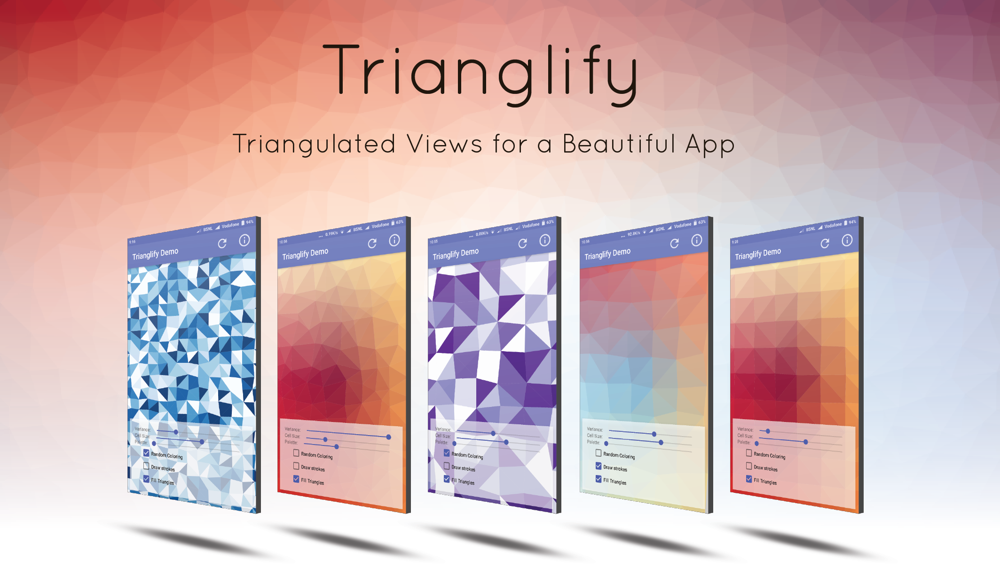

<!--  

<br> 
<br> 
<div align="center"></div>
<br> 
<br>

-->

# Trianglify

<!-- [](https://travis-ci.com/sdsmdg/trianglify) -->
[](https://www.android.com)
[](https://android-arsenal.com/api?level=16s)
[](https://opensource.org/licenses/MIT)
[](https://mdg.sdslabs.co)



<a href='http://bit.ly/trianglify_mdg'></a>

Trianglify is an Android library that helps creates views with beautiful patterns. Trianglify is based on MVP architecture and licensed under MIT license.

# How to Apply

Include following line in the gradle script of your application to include latest release of Trianglify:
```gradle
compile 'com.sdsmdg.kd:trianglify:1.0.0'
```

# Latest Release
* [Version 1.0.0](https://bintray.com/suyashmahar/trianglify/trianglify/1.0.0)
 | [Google Play](http://bit.ly/trianglify_mdg)  
**First stable release of Trianglify**
    * Updated documents so that Trianglify can be seamlessly integrated anywhere
    * Fixed bugs in demo app

For more check complete [change log](/CHANGELOG.md).  

# Usages and Documentation
For details on usage and documentation of Trianglify, check documentation [here](DOCUMENTATION.md).

# Credits
Trianglify is inspired from qrohlf's work to generate triangle art, [Trianglify](https://github.com/qrohlf/trianglify)  

Development of Trianglify wouldn't have been possible without following libraries:
* [Delaunay Triangulator by jdiemke](https://github.com/jdiemke/delaunay-triangulator)
* [Color Picker by QuadFlask](https://github.com/QuadFlask/colorpicker)


# Guidelines for Contributors
If you want to contribute to improve this library, please read [our guidelines](CONTRIBUTING.md).

# License
Trianglify is licensed under `MIT license`. View license [here](LICENSE.md).
